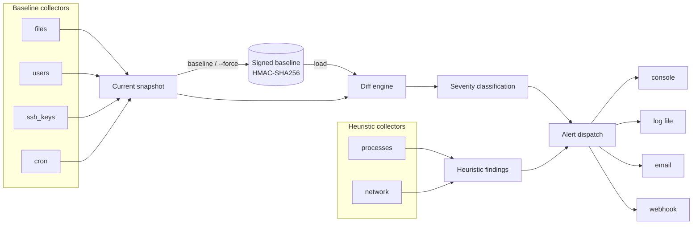

# Architecture

Baseline Guard is a pipeline: **collect → store/diff → classify → alert**.
Each stage is a small, independently testable module, and the whole thing
is wired together in `baselineguard/engine.py`.

## Two kinds of collector

**Baseline collectors** (`files`, `users`, `ssh_keys`, `cron`) produce
state that's expected to stay stable between scans. Their output is
what gets signed, persisted, and diffed on every `scan`.

**Heuristic collectors** (`processes`, `network`) produce state that
changes on essentially every scan by design — process IDs and ephemeral
ports are not meant to be stable. Diffing them against a fixed baseline
would mostly produce noise, so instead they evaluate live state against
policy on every run: is anything executing from a writable scratch
directory, is anything listening on a port outside the allowlist, is a
process still running from a binary that's been deleted off disk. See
`baselineguard/collectors/base.py` for the two corresponding interfaces
(`Collector.collect()` vs. a heuristic collector's `scan()`).

## Signed storage

A baseline is a security control, not just a cache — if an attacker who
has compromised the host can silently edit the stored baseline, they can
make their own changes invisible on the next scan. `storage.py` guards
against that specific failure mode (not against a host being fully
compromised in general — see [`THREAT_MODEL.md`](THREAT_MODEL.md)):

1. On first use, a random 256-bit key is generated and written to
   `signing.key` with `0600` permissions.
2. Every save wraps the collector output in an envelope:
   `{"payload": {...}, "signature": HMAC-SHA256(key, canonical_json(payload))}`.
3. Every load recomputes the HMAC and compares it with
   `hmac.compare_digest` (constant-time) before trusting the content. A
   mismatch raises `TamperDetected` rather than returning bad data.

`canonical_json_bytes()` in `hashing.py` sorts keys and uses tight
separators so the same logical payload always serializes to the same
bytes — without that, dict key ordering could make an unmodified
baseline fail its own signature check.

## Diff and severity

`diff.py` is collector-agnostic: given two `{item_id: record}` mappings
it produces `added` / `removed` / `modified` `Change` objects, with
`modified` listing exactly which fields changed. Severity starts from a
per-collector default (e.g. `users` changes default to `HIGH`) and is
then upgraded by `classify_severity()` when a record matches a known
high-risk pattern — a new SUID/SGID file, a new UID-0 account, a UID
change on an existing account, a new SSH key for `root`, or a hash
change on `/etc/passwd`, `/etc/shadow`, or `/etc/sudoers` specifically.

## Alert dispatch

`engine.BaselineGuard.dispatch()` converts every `Change` and `Finding`
into a common `Alert` and fans it out to whichever channels are enabled
in config (see `docs/CONFIGURATION.md`). Channels are independent and
failure-isolated — a webhook endpoint being unreachable can't stop the
console or log-file channel from running, and can't make `scan` exit
with the wrong status code.

## Why (almost) zero dependencies

The only import outside the standard library is `ruff`, and only for
linting in CI — nothing in `baselineguard/` itself needs it at runtime.
For a tool whose entire job is telling you whether your system's state
can be trusted, minimizing what you have to trust in the tool itself
(supply chain included) is part of the design, not an afterthought.
